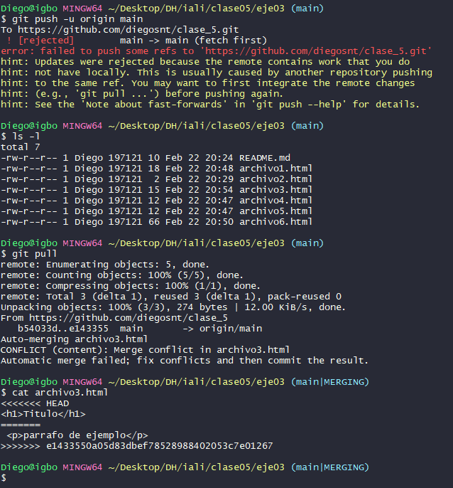
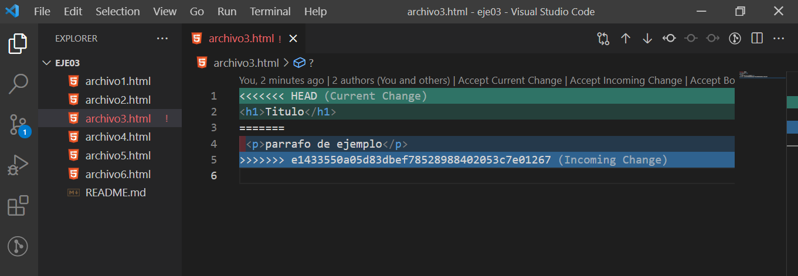
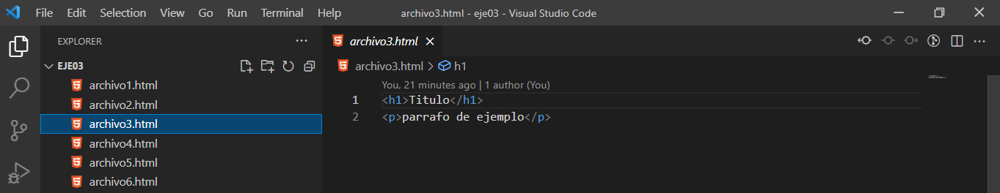
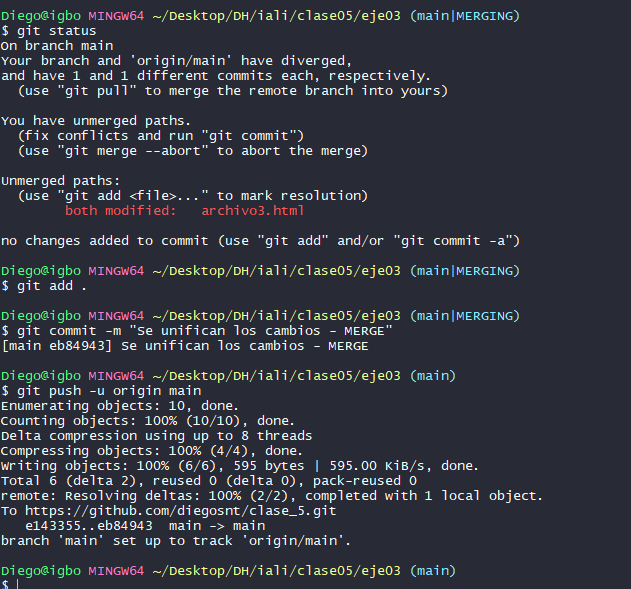

# Clase_5

## Resolver un conflicto

- El primer participante que sincronice el archivo podrá hacerlo sin problema. El segundo recibirá una notificación de que existen cambios en el repositorio remoto.

